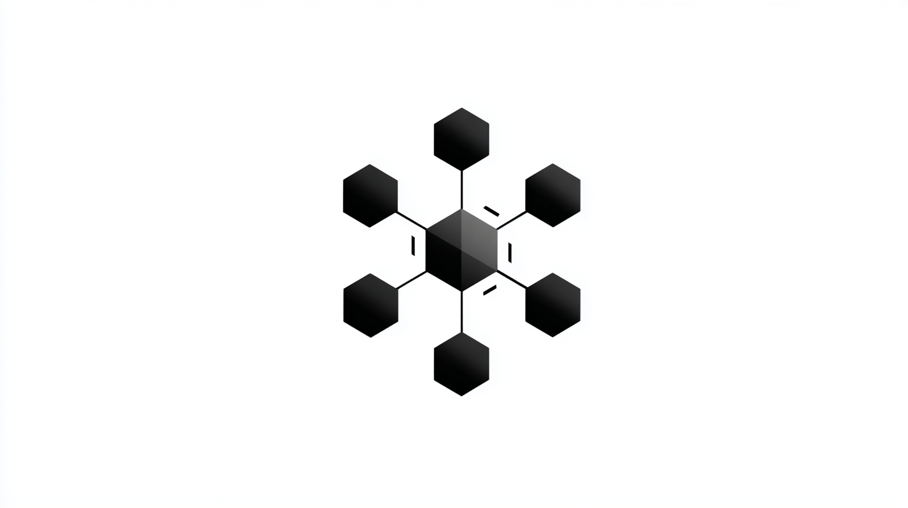

# Nano Agent
> Watched how we used GPT-5 and Claude Code with nano-agents [here](https://youtu.be/tcZ3W8QYirQ).

**What?** A MCP Server for experimental, small scale engineering agents with multi-provider LLM support.

**Why?** To test and compare **Agentic** Capabilities of Cloud and Local LLMs across Performance, Speed, and Cost.

> "It's not about a single prompt call anymore. It's about how well your agent chains together multiple tools to accomplish real engineering results on your behalf." - From our evaluation



### 🎬 See It In Action

**Multi-Model Evaluation Flow** - Watch 9 models (GPT-5, Claude Opus, Local GPT-OSS) running in parallel on the same M4 Max:


**Model Comparison: GPT-5 vs Local Models** - Surprising results: GPT-OSS 20B/120B running on-device with $0.00 cost:


### 🔥 Key Findings from Our Testing

- **Surprising Winners**: GPT-5 Nano/Mini often outperform larger models when factoring in speed and cost
- **Local Revolution**: GPT-OSS 20B/120B models complete real agentic coding tasks on M4 Max (128GB RAM)
- **Cost Reality Check**: Claude Opus 4.1 is extraordinarily expensive - performance isn't everything
- **The Trade-off Triangle**: Performance vs Speed vs Cost - you don't always need the most expensive model

## Installation

### Quick Install (Recommended)

- Install [Astral UV](https://docs.astral.sh/uv/getting-started/installation/)
- Setup [Claude Code](https://docs.anthropic.com/en/docs/claude-code/overview)
- Setup [Ollama](https://ollama.com/)
- Get your OpenAI API key and Anthropic API key
- Setup dotenv
  - `cp ./.env.sample ./.env` and fill out variables
  - `cp ./apps/nano_agent_mcp_server/.env.sample ./apps/nano_agent_mcp_server/.env` and fill out variables
- Clone the repository
  - `git clone https://github.com/disler/nano-agent`
- Global Install `nano-agent` to expose it for Claude Code (any mcp client)
  - `cd nano-agent/apps/nano_agent_mcp_server`
  - `./scripts/install.sh`
  - `uv tool install -e .`
- cp `.mcp.json.sample` to `.mcp.json` to use `nano-agent`
- You should end up with a `.mcp.json` file that looks like this:
```json
{
  "mcpServers": {
    "nano-agent": {
      "command": "nano-agent",
      "args": []
    }
  }
}
```
- You can also test without installing `nano-agent` globally by running it this directory with
```json
{
  "mcpServers": {
    "nano-agent": {
      "command": "uv",
      "args": ["--directory", "apps/nano_agent_mcp_server", "run", "nano-agent"]
    }
  }
}
```

Now you can follow the [Nano Agent Interaction section below](#nano-agent-interaction) to test out the nano agent.

## Nano Agent Interaction

There are three ways to interact with the nano agent.
1. Nano Agent **Through the CLI** (`uv run nano-cli run`)
   - Great for understanding agent capabilities
2. Nano Agent **Through Claude Code** or any MCP client (`.mcp.json` or equivalent configuration)
   - Great for delegating work and scaling up compute in the field
3. Nano Agent **Through the Higher Order Prompt** (HOP) and Lower Order Prompt (LOP) pattern to test and compare models across providers and models.

### Through the CLI

Remember, when running directly your current directory is where ever you run `uv run nano-cli run` from.

```bash
cd apps/nano_agent_mcp_server

# Test tools without API
uv run nano-cli test-tools

# Run with different models (provider auto-detected from model name)
uv run nano-cli run "List all Python files in the current directory"  # gpt-5-mini (default)
uv run nano-cli run "Create a hello world script in python" --model gpt-5-nano
uv run nano-cli run "Summarize the README.md" --model gpt-5

# Test Anthropic models (requires ANTHROPIC_API_KEY)
uv run nano-cli run "Hello" --model claude-3-haiku-20240307 --provider anthropic
uv run nano-cli run "Hello" --model claude-sonnet-4-20250514 --provider anthropic
uv run nano-cli run "Hello" --model claude-opus-4-20250514 --provider anthropic
uv run nano-cli run "Hello" --model claude-opus-4-1-20250805 --provider anthropic

# Test local Ollama models (requires ollama service) (be sure to install the model first with `ollama pull gpt-oss:20b`)
uv run nano-cli run "List files" --model gpt-oss:20b --provider ollama
uv run nano-cli run "List files and count the total number of files and directories" --model gpt-oss:120b --provider ollama

# Verbose mode (shows token usage)
uv run nano-cli run "Create and edit a test file" --verbose
```

### Through Claude Code

#### Call the MCP server directly

```prompt
mcp nano-agent: prompt_nano_agent "Create a hello world script in python" --model gpt-5
mcp nano-agent: prompt_nano_agent "Summarize the README.md" --model claude-opus-4-1-20250805 --provider anthropic
mcp nano-agent: prompt_nano_agent "Read the first 10 lines and last 10 lines of the README.md" --verbose
etc...
```

#### Call the MCP server through a sub-agent

```prompt
@agent-nano-agent-gpt-5-mini "Create a hello world script in python"

@agent-nano-agent-gpt-5 "Summarize the <file name>"

@agent-nano-agent-claude-opus-4-1 "<insert agentic prompt here>"

@agent-nano-agent-gpt-oss-20b "<insert agentic prompt here>"

@agent-nano-agent-gpt-oss-120b "<insert agentic prompt here>"

@agent-nano-agent-claude-sonnet-4 "<insert agentic prompt here>"

@agent-nano-agent-claude-3-haiku "<insert agentic prompt here>"
```

### Through the Higher Order Prompt (HOP) and Lower Order Prompt (LOP) pattern

In Claude Code call

```
/perf:hop_evaluate_nano_agents .claude/commands/perf/lop_eval_1__dummy_test.md

/perf:hop_evaluate_nano_agents .claude/commands/perf/lop_eval_2__basic_read_test.md

/perf:hop_evaluate_nano_agents .claude/commands/perf/lop_eval_3__file_operations_test.md

/perf:hop_evaluate_nano_agents .claude/commands/perf/lop_eval_4__code_analysis_test.md

/perf:hop_evaluate_nano_agents .claude/commands/perf/lop_eval_5__complex_engineering_test.md
```

#### Understanding HOP/LOP: How It Works

The **HOP/LOP pattern** enables systematic parallel evaluation of multiple models:

- **HOP (Higher Order Prompt)**: The orchestrator that reads test files, delegates to agents in parallel, and grades results
- **LOP (Lower Order Prompt)**: Individual test definitions with prompts, expected outputs, and grading rubrics
- **Execution Flow**: HOP → reads LOP → calls 9 agents simultaneously → collects results → generates comparison tables

**Example**: When you run `/perf:hop_evaluate_nano_agents lop_eval_3__file_operations_test.md`:
1. HOP reads the test specification from the LOP file
2. Extracts the prompt and list of agents to test
3. Executes all agents in parallel (GPT-5, Claude, Local models)
4. Each agent runs in isolation via the nano-agent MCP server
5. Results are graded on Performance, Speed, and Cost
6. Output shows ranked comparison with surprising results (e.g., Claude-3-haiku often beats expensive models)

This architecture ensures fair comparison by using the same OpenAI Agent SDK for all providers, creating a true apples-to-apples benchmark.

## Features

- 🤖 **Multi-Provider Support**: Seamlessly switch between OpenAI (GPT-5), Anthropic (Claude), and Ollama (local models)
- 🔧 **File System Operations**: Read, write, edit, and analyze files autonomously
- 🏗️ **Nested Agent Architecture**: MCP server spawns internal agents for task execution
- 🎯 **Unified Interface**: All providers use the same OpenAI SDK for consistency
- 📦 **Experiment Ready**: Decent testing, error handling, and token tracking
- 🚀 **Easy Integration**: Works with Claude Desktop, or as a CLI

## Nano-Agent Tools
> Feel free to add/remove/improve tools as you see fit.

Nano-Agent tools are stored in `nano_agent_tools.py`.

Tools are:
- `read_file` - Read file contents
- `list_directory` - List directory contents (defaults to current working directory)
- `write_file` - Create or overwrite files
- `get_file_info` - Get file metadata (size, dates, type)
- `edit_file` - Edit files by replacing exact text matches

## Project Structure

```
nano-agent/
├── apps/                           # ⚠️ ALL APPLICATION CODE GOES HERE
│   └── nano_agent_mcp_server/     # Main MCP server application
│       ├── src/                    # Source code
│       │   └── nano_agent/         # Main package
│       │       ├── modules/        # Core modules
│       │       │   ├── constants.py         # Model/provider constants & defaults
│       │       │   ├── data_types.py        # Pydantic models & type definitions
│       │       │   ├── files.py             # File system operations
│       │       │   ├── nano_agent.py        # Main agent execution logic
│       │       │   ├── nano_agent_tools.py  # Internal agent tool implementations
│       │       │   ├── provider_config.py   # Multi-provider configuration
│       │       │   ├── token_tracking.py    # Token usage & cost tracking
│       │       │   └── typing_fix.py        # Type compatibility fixes
│       │       ├── __main__.py     # MCP server entry point
│       │       └── cli.py          # CLI interface (nano-cli)
│       ├── tests/                  # Test suite
│       │   ├── nano_agent/         # Unit tests
│       │   └── isolated/           # Provider integration tests
│       ├── scripts/                # Installation & utility scripts
│       ├── pyproject.toml          # Project configuration & dependencies
│       ├── uv.lock                 # Locked dependency versions
│       └── .env.sample             # Environment variables template
├── .claude/                        # Claude Code configuration
│   ├── agents/                     # Sub-agent configurations (9 models)
│   │   ├── nano-agent-gpt-5-nano.md         # OpenAI GPT-5 Nano
│   │   ├── nano-agent-gpt-5-mini.md         # OpenAI GPT-5 Mini (default)
│   │   ├── nano-agent-gpt-5.md              # OpenAI GPT-5
│   │   ├── nano-agent-claude-opus-4-1.md    # Claude Opus 4.1
│   │   ├── nano-agent-claude-opus-4.md      # Claude Opus 4
│   │   ├── nano-agent-claude-sonnet-4.md    # Claude Sonnet 4
│   │   ├── nano-agent-claude-3-haiku.md     # Claude 3 Haiku
│   │   ├── nano-agent-gpt-oss-20b.md        # Ollama 20B model
│   │   ├── nano-agent-gpt-oss-120b.md       # Ollama 120B model
│   │   └── hello-world.md                   # Simple greeting agent
│   ├── commands/                   # Claude Code commands
│   │   ├── perf/                   # Performance evaluation commands
│   │   │   ├── hop_evaluate_nano_agents.md  # Higher Order Prompt orchestrator
│   │   │   ├── lop_eval_1__dummy_test.md    # Simple Q&A test
│   │   │   ├── lop_eval_2__basic_read_test.md   # File reading test
│   │   │   ├── lop_eval_3__file_operations_test.md  # Complex I/O test
│   │   │   ├── lop_eval_4__code_analysis_test.md    # Code understanding
│   │   │   └── lop_eval_5__complex_engineering_test.md  # Full project test
│   │   ├── convert_paths_absolute.md   # Convert to absolute paths
│   │   ├── convert_paths_relative.md   # Convert to relative paths
│   │   ├── create_worktree.md          # Git worktree management
│   │   ├── plan.md                     # Planning template
│   │   ├── prime.md                    # Codebase understanding
│   │   └── build.md                    # Build commands
│   ├── hooks/                      # Development hooks
│   ├── settings.json               # Portable settings (relative paths)
│   └── settings.local.json         # Local settings (absolute paths)
├── eval_results_1_dummy_test.md    # Q&A test benchmark results
├── eval_results_2_basic_read_test.md   # File reading benchmark results
├── eval_results_3_file_operations_test.md  # I/O benchmark results
├── eval_results_4_code_analysis_test.md    # Code analysis benchmark results
├── eval_results_5_complex_engineering_test.md  # Project creation benchmark results
├── images/                         # Documentation images
│   └── nano-agent.png             # Project logo/diagram
├── app_docs/                       # Application-specific documentation
├── ai_docs/                        # AI/LLM documentation & guides
│   ├── python_uv_mcp_server_cookbook.md    # MCP server development guide
│   ├── openai_agent_sdk_*.md      # OpenAI SDK documentation
│   ├── anthropic_openai_compat.md # Anthropic compatibility guide
│   ├── ollama_openai_compat.md    # Ollama compatibility guide
│   └── new_openai_gpt_models.md   # GPT-5 model specifications
└── specs/                          # Technical specifications
```

## Development Guidelines

### Prerequisites
- Python 3.12+ (required for proper typing support)
- [uv](https://github.com/astral-sh/uv) package manager
- OpenAI API key (for GPT-5 model tests)

### Development Setup

```bash
cd apps/nano_agent_mcp_server
uv sync --extra test  # Include test dependencies
```

### Claude Code Hook Configuration

If you're using Claude Code to work on this codebase, the project includes hooks for enhanced development experience. The hooks use relative paths by default for portability.

**To activate hooks with absolute paths for your local environment:**
Convert relative paths to absolute paths in .claude/settings.local.json
Run this command in Claude Code:
This updates all hook paths to use your machine's absolute paths
A backup is automatically created at .claude/settings.json.backup

`/convert_paths_absolute.md`

**Note:** The hooks are optional but provide useful features like:
- Pre/post tool use notifications
- Session tracking
- Event logging for debugging

For production use, see [Installation](#installation) section above.

#### UV Dependency Management

When working with UV and optional dependencies:
- `uv sync` - Installs only the main dependencies (mcp, typer, rich)
- `uv sync --extra test` - Installs main + test dependencies (includes pytest, openai, etc.)
- `uv sync --all-extras` - Installs main + all optional dependency groups
- `uv pip list` - Shows all installed packages in the virtual environment

**Important:** Always use `--extra test` when you need to run tests, as `uv sync` alone will remove test dependencies.

### Configuration

1. Copy the environment template:
```bash
cp .env.sample .env
```

2. Add your OpenAI API key:
```bash
echo "OPENAI_API_KEY=sk-your-key-here" > .env
```

### Running the Server

```bash
cd apps/nano_agent_mcp_server
uv run nano-agent --help
```

The server communicates via stdin/stdout using the MCP protocol.

## Nano Agent Architecture

### Nested Agent Hierarchy

**Key Concept:** This is a nested agent system with two distinct agent layers.

```text
┌─────────────────────────────────────────────────────────────┐
│ OUTER AGENT (e.g., Claude Code, any MCP client)            │
│   • Communicates via MCP protocol                          │
│   • Sees ONE tool: prompt_nano_agent                       │
│   • Sends natural language prompts to nano-agent           │
└─────────────────────────────────────────────────────────────┘
                            │
                            │ MCP Protocol
                            ▼
┌─────────────────────────────────────────────────────────────┐
│ NANO-AGENT MCP SERVER (apps/nano_agent_mcp_server)         │
│   • Exposes SINGLE MCP tool: prompt_nano_agent             │
│   • Receives prompts from outer agent                      │
│   • Spawns internal OpenAI agent to handle request         │
└─────────────────────────────────────────────────────────────┘
                            │
                            │ Creates & Manages
                            ▼
┌─────────────────────────────────────────────────────────────┐
│ INNER AGENT (OpenAI GPT with function calling)             │
│   • Created fresh for each prompt_nano_agent call          │
│   • Has its OWN tools (not visible to outer agent):        │
│     - read_file: Read file contents                        │
│     - list_directory: List directory contents              │
│     - write_file: Create/overwrite files                   │
│     - get_file_info: Get file metadata                     │
│   • Runs autonomous loop (max 20 turns)                    │
│   • Returns final result to MCP server → outer agent       │
└─────────────────────────────────────────────────────────────┘
```

## Validation & Testing

### Unit Tests (Real API Calls)
```bash
# Run all integration tests
uv run pytest tests/ -v

# Test specific functionality
uv run pytest tests/nano_agent/modules/test_nano_agent.py::TestExecuteNanoAgent -v

# Quick validation
uv run pytest -k "test_execute_nano_agent_success" -v
```

### CLI Validation
```bash
# Validate tools work (no API needed)
uv run nano-cli test-tools

# Quick agent test
export OPENAI_API_KEY=sk-your-key
uv run nano-cli run "What is 2+2?"  # Uses DEFAULT_MODEL
```

## Multi-Provider Support

The nano agent supports multiple LLM providers through a unified interface using the OpenAI SDK. All providers are accessed through OpenAI-compatible endpoints, providing a consistent API.

### Available Providers & Models
> Feel free to add/remove providers and models as you see fit.

#### OpenAI (Default)
- **Models**: `gpt-5`, `gpt-5-mini` (default), `gpt-5-nano`, `gpt-4o`
- **Requirements**: `OPENAI_API_KEY` environment variable
- **Special Features**: 
  - GPT-5 models use `max_completion_tokens` instead of `max_tokens`
  - GPT-5 models only support temperature=1
  - Extended context windows (400K tokens)

#### Anthropic
- **Models**: `claude-opus-4-1-20250805`, `claude-opus-4-20250514`, `claude-sonnet-4-20250514`, `claude-3-haiku-20240307`
- **Requirements**: `ANTHROPIC_API_KEY` environment variable
- **Implementation**: Uses Anthropic's OpenAI-compatible endpoint
- **Base URL**: `https://api.anthropic.com/v1/`

#### Ollama (Local Models)
- **Models**: `gpt-oss:20b`, `gpt-oss:120b`, or any model you've pulled locally
- **Requirements**: Ollama service running locally
- **Implementation**: Uses Ollama's OpenAI-compatible API
- **Base URL**: `http://localhost:11434/v1`

### Using Different Providers

#### CLI Usage
```bash
# OpenAI (default)
uv run nano-cli run "Create a hello world script"

# Use specific OpenAI model
uv run nano-cli run "Analyze this code" --model gpt-5 --provider openai

# Anthropic
uv run nano-cli run "Write a test file" --model claude-3-haiku-20240307 --provider anthropic

# Ollama (local)
uv run nano-cli run "List files" --model gpt-oss:20b --provider ollama
```

## Multi-Model Evaluation System

The nano-agent includes a sophisticated multi-layer evaluation system for comparing LLM performance across different providers and models. This creates a level playing field for benchmarking by using the same execution environment (OpenAI Agent SDK) regardless of the underlying provider.

> "Don't trust any individual benchmark. You need to crack open the hood of all these models and say, where is the true value?" - Engineering is all about trade-offs.

### 🎯 The Bread and Butter: HOP/LOP Pattern

The evaluation system's core innovation is the **HOP/LOP (Higher Order Prompt / Lower Order Prompt)** pattern, which creates a hierarchical orchestration system for parallel model testing:

```text
┌─────────────────────────────────────────────────────────────┐
│ 1. HIGHER ORDER PROMPT (HOP)                                │
│   File: .claude/commands/perf/hop_evaluate_nano_agents.md  │
│   • Orchestrates entire evaluation process                  │
│   • Accepts test case files as $ARGUMENTS                   │
│   • Formats and grades results                              │
│   • Generates performance comparison tables                 │
└─────────────────────────────────────────────────────────────┘
                            │
                            │ Reads & Executes
                            ▼
┌─────────────────────────────────────────────────────────────┐
│ 2. LOWER ORDER PROMPT (LOP)                                 │
│   Files: .claude/commands/perf/lop_eval_*.md               │
│   • Defines test cases (prompts to evaluate)               │
│   • Lists agents to test (@agent-nano-agent-*)             │
│   • Specifies expected outputs                             │
│   • Provides grading rubrics                               │
└─────────────────────────────────────────────────────────────┘
                            │
                            │ @agent References
                            ▼
┌─────────────────────────────────────────────────────────────┐
│ 3. CLAUDE CODE SUB-AGENTS                                   │
│   Files: .claude/agents/nano-agent-*.md                    │
│   • Individual agent configurations                        │
│   • Each specifies model + provider combination            │
│   • Color-coded by model family:                          │
│     - green: GPT-5 series (nano, mini, standard)          │
│     - blue: GPT-OSS series (20b, 120b)                    │
│     - purple: Claude 4 Opus models                        │
│     - orange: Claude 4 Sonnet & Claude 3 Haiku            │
└─────────────────────────────────────────────────────────────┘
                            │
                            │ Calls MCP Server
                            ▼
┌─────────────────────────────────────────────────────────────┐
│ 4. NANO-AGENT MCP SERVER                                    │
│   Function: prompt_nano_agent(prompt, model, provider)     │
│   • Creates isolated agent instance per request            │
│   • Uses OpenAI Agent SDK for ALL providers               │
│   • Ensures consistent execution environment               │
│   • Returns structured results with metrics                │
└─────────────────────────────────────────────────────────────┘
```

### Why This Architecture?

1. **Fair Comparison**: All models use the same OpenAI Agent SDK, eliminating implementation differences
2. **Parallel Execution**: Agents run simultaneously, reducing temporal variations
3. **Structured Metrics**: Consistent tracking of time, tokens, and costs across all providers
4. **Extensibility**: Easy to add new models, providers, or test cases
5. **Visual Hierarchy**: Color-coded agents make results easy to scan in Claude Code
6. **Reproducibility**: Same prompts and execution environment ensure consistent benchmarks

## License

MIT

## Master AI Coding
> And prepare for Agentic Engineering

Learn to code with AI with foundational [Principles of AI Coding](https://agenticengineer.com/principled-ai-coding?y=nanoagent)

Follow the [IndyDevDan youtube channel](https://www.youtube.com/@indydevdan) for more AI coding tips and tricks.
